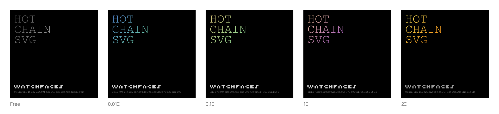
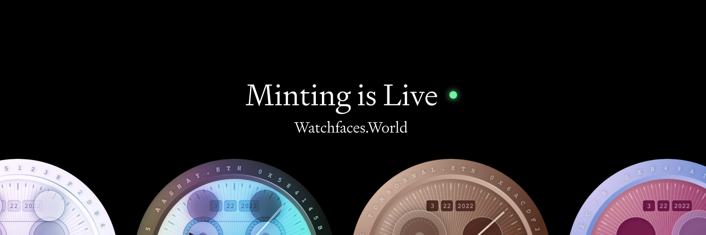

# hot-chain-svg

A toolkit for building on-chain SVG projects.

## Demo


## Getting started

Feel free to clone the repo and tune it for your own needs. The codebase tries to be self-contained and only depends on NodeJS. You can integrate it with [Hardhat](https://hardhat.org/) and [Foundry](https://github.com/gakonst/foundry)-based projects.

```
$ git clone https://github.com/w1nt3r-eth/hot-chain-svg
$ cd hot-chain-svg
$ yarn
```

### Hot Reloading

```
$ yarn start
```

Open the URL (http://localhost:9901). Every time you change `Renderer.sol`, the webpage will automatically refresh. Use Chrome DevTools to inspect the page.

### Visual QA

```
$ yarn qa
```

This will render 256 tokens into a temporary folder. It will also check the resulting SVG for syntax errors. Open the folder and view the resulting files. Feel free to edit `src/qa.js`.

### React-inspired API

You'll notice there's `SVG.sol` inside the `contracts` folder. The idea is to provide a React-inspired API, tailored to SVG graphics. It's not complete. You don't have to use it to benefit from hot reloading and visual QA script.

## Under the hood

`hot-chain-svg` uses `solc` to compile Solidity files. Then, it deploys it to a local VM instance (powered by `@ethereumjs/vm`) and calls the `example` function. The resulting SVG image is served via the built-in HTTP server.

The tool also watches the files in `contracts` for changes. When it detects a change, it sends an event to the browser via EventSource subscription, which causes the page to reload.

## Foundry

### Getting started

Run `forge install` to install all dependencies.

### Hot Reloading

```
$ yarn start:forge

or

$ FOUNDRY_PROFILE=watch forge test --match-contract Watch -vvv --watch
```

When run in combination with `forge test --watch`, the `test/Watch.t.sol` file will continuously update `qa/0.svg` (or whichever file you specify). Since this file is not served via a local web server, it is best viewed within a pane of your IDE for realtime updates.

### Visual QA

```
$ yarn qa:forge

or

$ forge script script/qa.s.sol -vvv --ffi
```

The script `script/qa.s.sol` emulates the behavior of the script `src/qa.js`, including checking for syntax errors. Output will be rendered to `qa/`

## Projects & Supporters

<!-- begin_users -->

- [Hot Chain SVG](https://etherscan.io/address/0xa7988c8abb7706e024a8f2a1328e376227aaad18) by w1nt3r.eth
- [Watchfaces.World](https://etherscan.io/address/0x8d3b078d9d9697a8624d4b32743b02d270334af1) by w1nt3r.eth
- [TsujiPoker](https://etherscan.io/address/0x2442f53979e9d0b990a7029e95cfdac6ad3a81df) by kaki.eth
- [Gawds](https://etherscan.io/address/0x3769c5700da07fe5b8eee86be97e061f961ae340) by jamiedubs.eth
- [Kinetic Spectrums](https://etherscan.io/address/0x2ac9795ca8fc6d09a5748cb9e8b9d67f4b09df07) by himlate.eth
- [Runes of Eth](https://etherscan.io/address/0x555555551777611fd8eb00df11ea0904b560cf74) by w1nt3r.eth
<!-- end_users -->

[](https://github.com/w1nt3r-eth/hot-chain-svg/actions/workflows/sync-nfts.yml)

If your project is using `hot-chain-svg`, you can add it to this list by minting a free NFT. The NFTs are automatically synced with this README using a cron job on GitHub Actions.

You can also support the project by sending Ether when minting the NFT.

To mint

1. Open [Hot Chain SVG](https://etherscan.io/address/0xa7988c8abb7706e024a8f2a1328e376227aaad18#writeContract) on Etherscan
2. Inside "Contract" tab, select "Write Contract"
3. Connect your wallet
4. Choose `mint` function
   - `payableAmount (ether)` is the optional donation to send to the project. The card will be rendered differently depending on the amount (see below)
   - `name` is the project name as it will appear on the card
   - `collection` is the address on your contract that uses `hot-chain-svg` (you can use your own wallet address if you don't have a contract deployed)

<a href="https://opensea.io/collection/hot-chain-svg"></a>

## Contributing

Check out GitHub issues and feel free to send a PR. The codebase tries to stick to vanilla JS and minimum dependencies, there are more interesting things in the world than fighting TypeScript and ES6 modules.

## Credits

Built by [@w1nt3r_eth](https://twitter.com/w1nt3r_eth) and [@tylerangert](https://twitter.com/tylerangert).
This project was extracted from [Watchfaces.World](https://www.watchfaces.world/).

<a href="https://www.watchfaces.world/"></a>
